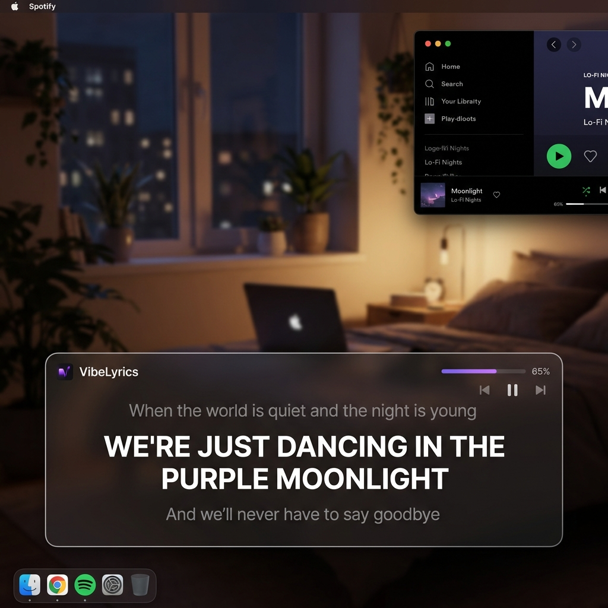

# 🎵 VibeLyrics — Floating Lyrics Overlay

A desktop application that displays floating live lyrics on top of **any screen, app, browser, game, or video** — like subtitle overlays.

Built with **Python** and **PyQt6** with a modern **glassmorphism** UI inspired by Spotify Lyrics and Musixmatch.



---

## 📥 Download (Pre-Built)

**No Python required!** Just download, extract, and run.

1. Download the latest `VibeLyrics_v1.0.0_Windows.zip` from Releases
2. Extract the ZIP to any folder
3. Run `VibeLyrics.exe`
4. That's it! 🎉

> **Note:** Settings are saved to `%APPDATA%\VibeLyrics\settings.json` and persist across updates.

---

## ✨ Features

| Feature | Description |
|---------|-------------|
| 🪟 **Floating Overlay** | Transparent, frameless, always-on-top window |
| 🎤 **Live Lyrics Sync** | Real-time synced lyrics with `.lrc` timestamp parsing |
| 🔍 **Auto Detection** | Detects currently playing song from Spotify, YouTube, VLC, etc. |
| 🌐 **LRCLIB API** | Free lyrics from [lrclib.net](https://lrclib.net) — no API key needed |
| 🎨 **Glassmorphism UI** | Dark translucent panel with gradient background |
| ✍️ **Karaoke Mode** | Progressive word highlighting on the current line |
| ⚙️ **Settings Panel** | Font, colors, opacity, alignment, and behavior controls |
| 📏 **Mini Mode** | Compact single-line view |
| 👆 **Click-Through** | Mouse clicks pass through to apps below |
| 🔤 **Keyboard Shortcuts** | Global hotkeys for quick control |
| 📌 **System Tray** | Runs in background with tray icon menu |
| 🚀 **Windows Startup** | Optional auto-start with Windows |

---

## 📁 Project Structure

```
VibeLyrics/
├── main.py              # Entry point, system tray, wiring
├── overlay.py           # Floating overlay window (lyrics display)
├── settings.py          # Settings panel UI + JSON persistence
├── spotify_handler.py   # Media detection (Windows SMTC + fallback)
├── lyrics_fetcher.py    # LRCLIB API client
├── lrc_parser.py        # .lrc parser + sync engine
├── build.py             # 🔨 Build script (creates .exe)
├── requirements.txt     # Python dependencies
├── settings.json        # Auto-generated settings file
├── assets/
│   ├── icon.ico         # App icon (auto-generated by build)
│   └── preview.png      # Screenshot
└── venv/                # Virtual environment (auto-created)
```

---

## 🛠️ Installation (From Source)

### Prerequisites
- **Python 3.10+** installed on Windows
- **Windows 10 or later** (required for media detection)

### Step 1: Clone or download the project

```bash
cd VibeLyrics
```

### Step 2: Create and activate virtual environment

```bash
python -m venv venv
venv\Scripts\activate
```

### Step 3: Install dependencies

```bash
pip install -r requirements.txt
```

---

## 🚀 Running (From Source)

```bash
# Make sure the venv is activated
venv\Scripts\activate

# Run the app
python main.py
```

The overlay will appear centered at the bottom of your screen. Play any song on Spotify (or any media player) and lyrics will auto-load!

---

## 🔨 Building the Executable

To create a standalone `.exe` that anyone can run without Python:

```bash
# Make sure venv is activated
venv\Scripts\activate

# Run the build script
python build.py
```

This will:
1. Install build dependencies (PyInstaller, Pillow)
2. Generate the app icon
3. Bundle everything into `dist/VibeLyrics/VibeLyrics.exe`
4. Create a `VibeLyrics_v1.0.0_Windows.zip` ready to share

### Sharing with Others
- Send them the ZIP file
- They extract it to any folder
- They run `VibeLyrics.exe`
- **No Python, no terminal, no setup needed!**

---

## ⌨️ Keyboard Shortcuts

| Shortcut | Action |
|----------|--------|
| `Ctrl+Shift+H` | Show / Hide overlay |
| `Ctrl+Shift+Up` | Increase font size |
| `Ctrl+Shift+Down` | Decrease font size |
| `Ctrl+Alt+PgUp` | Track offset +0.5s |
| `Ctrl+Alt+PgDown` | Track offset -0.5s |
| `Ctrl+Shift+L` | Open settings panel |
| `Ctrl+Shift+M` | Toggle mini mode |
| `Ctrl+Shift+T` | Toggle click-through mode |

---

## 🎮 Usage Tips

1. **Drag** the overlay by clicking and dragging anywhere on it
2. **Resize** using the grip handle at the bottom-right corner
3. **Double-click** the overlay to open Settings
4. **Right-click** the system tray icon for the context menu
5. **Manual search**: Open Settings and use the search fields when auto-detection doesn't work

---

## 🔧 How It Works

1. **Media Detection**: Uses Windows System Media Transport Controls (SMTC) to detect what's playing — works with Spotify, YouTube in browser, VLC, and more
2. **Lyrics Fetch**: Queries the free [LRCLIB API](https://lrclib.net) for synced `.lrc` lyrics (falls back to plain lyrics)
3. **Sync Engine**: Parses timestamps and uses binary search to find the correct lyric line for the current playback position
4. **Overlay Rendering**: Updates the display every 50ms with smooth fade animations and karaoke highlighting

---

## 📦 Dependencies

| Package | Purpose |
|---------|---------|
| `PyQt6` | Desktop UI framework |
| `requests` | HTTP client for LRCLIB API |
| `winsdk` | Windows media detection (SMTC) |
| `keyboard` | Global keyboard shortcuts |

### Build Dependencies (only needed to create the .exe)

| Package | Purpose |
|---------|---------|
| `PyInstaller` | Bundles Python into a standalone executable |
| `Pillow` | Generates the app icon (.ico file) |

---

## ⚠️ Troubleshooting

| Issue | Solution |
|-------|----------|
| No media detected | Make sure music is playing in Spotify/browser/VLC |
| Keyboard shortcuts not working | Run the app as Administrator |
| Lyrics not found | Try manual search in Settings |
| Overlay not visible | Check system tray → Show/Hide Overlay |
| Click-through mode stuck | Press `Ctrl+Shift+T` to toggle off |
| `.exe` won't start | Make sure you extracted the full ZIP (don't run from inside the archive) |
| Windows Defender blocks | Click "More info" → "Run anyway" (it's a false positive for unsigned apps) |

---

## 📄 License

MIT License — feel free to modify and share!

---

*Powered by [LRCLIB](https://lrclib.net) • Built with PyQt6*
